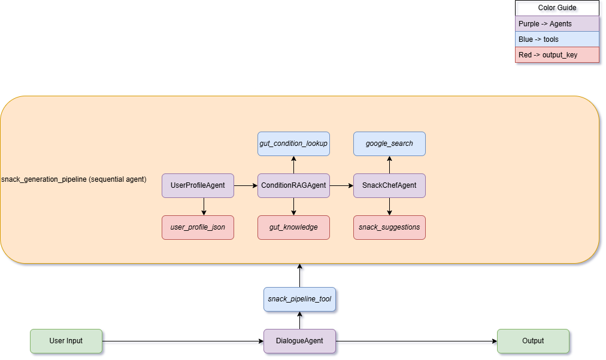
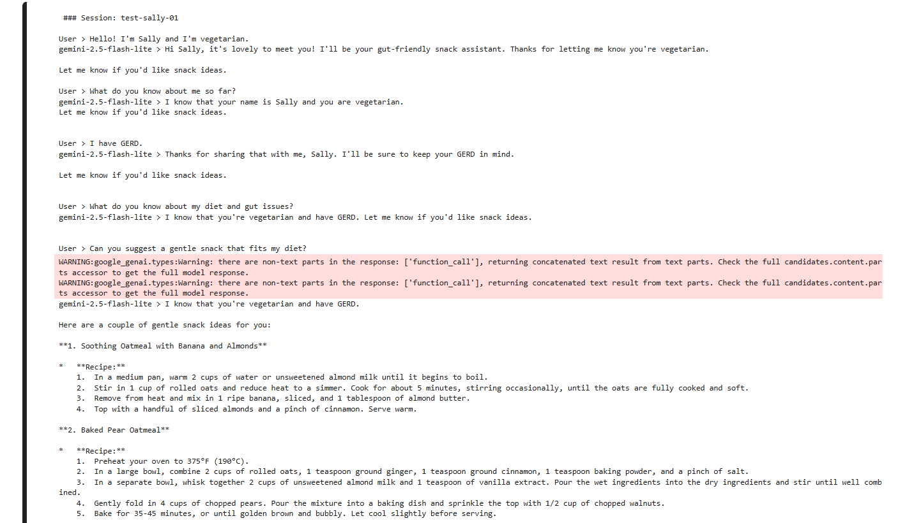

# Snack Guardian AI

A Personalized AI Snack Concierge for Sensitive Stomachs

> **Note:** Snack Guardian is being developed as the Capstone Project for the **Kaggle × Google 5-Day AI Agents Intensive (November 2025)**
>
> You can have a look at this [repo, 5-day AI Agent (Google X Kaggle)](https://github.com/dpurkays/5day-ai-agents-google-kaggle) for my notes and codelabs.

## 🧩 Problem

People with digestive sensitivities such as GERD, acid reflux, IBS, or food intolerances often struggle to know what snacks are safe to eat, especially when they are tired, stressed, or low on energy. Evaluating ingredients, searching online, and comparing contradictory advice becomes overwhelming, and most tools focus on general nutrition rather than digestive comfort. There is no simple system that understands symptoms, personal dietary restrictions, cravings, or long-term patterns all at once.

This problem is important because digestive flare-ups have immediate physical, emotional, and lifestyle costs. A single wrong snack can interrupt work, sleep, social plans, and overall well-being. As a result, people frequently rely on guesswork and end up eating snacks that trigger discomfort. Solving this problem means reducing avoidable pain and giving people a sense of confidence and safety around food choices. It is also an interesting problem because it requires personalization, reasoning, and real-time context awareness, which makes it a strong fit for an agent-based system.

## Why agents?

People with gut sensitivities need guidance that adapts to their symptoms, diet, and long-term patterns. Static tools cannot remember personal details, interpret context, or adjust recommendations as the user’s needs change. Snack decisions are personal, and the right answer depends on who the user is and how they feel in the moment.

Agents are the right solution because they can maintain a user profile, recall restrictions across conversations, and use reasoning to select safe foods from a structured knowledge base. They can coordinate multiple steps, such as extracting profile information, retrieving relevant gut-friendly foods, and generating snack ideas that match the user’s condition. This creates a personalized, responsive experience that a simple rule-based system cannot provide.

## 🌿 Solution

Snack Guardian AI is a multi-agent system designed to help people with digestive sensitivities choose snacks that feel safe and supportive. It collects and updates a personalized profile that includes symptoms, dietary restrictions, food preferences, and long-term gut conditions. Using this profile, the system retrieves relevant “safe” and “avoid” foods from a structured knowledge base and then generates snack ideas that match the user’s current needs, energy level, and cravings.

The agents work together to provide recommendations that feel thoughtful, personalized, and aligned with the user’s digestive comfort. Instead of generic suggestions, Snack Guardian AI offers snack ideas that respect the user’s limitations and help them avoid foods that may trigger discomfort.

## ⭐ Value

Snack Guardian helps users:

- Save time deciding what to eat
- Reduce discomfort by avoiding trigger foods
- Feel supported with gentle, personalized recommendations
- Discover new, safe snacks that match their energy level
- Build long-term awareness of patterns (“warm snacks feel better at night”)

Instead of relying on guesswork or generic lists, users get snack guidance that adapts to them.

## ⚙️ Tech & Tools

- Python
- Gemini 2.5 Flash Lite
- Google’s Agent Development Kit (ADK)
- Kaggle Notebook environment
- A small JSON knowledge base for gut-friendly food guidance
- Persistent memory through SQLite (`DatabaseSessionService`)

## 📚 Concepts Used

- Multi-agent Architecture
- Sequential Agent Workflow
- Custom Tools
- Persistent Memory
- RAG

## Implementation Overview

Snack Guardian AI is a multi-agent AI system built around a simple idea: the user should only have to talk to one friendly guide, while a team of specialized agents does the work in the background.

At the top is the `Guardian Dialogue Agent`, which is the main entry point for the user. This agent remembers personal details such as gut conditions, dietary restrictions, preferred foods, and patterns the user shares over time. It keeps the tone gentle and supportive, and decides when to call the snack pipeline. If the user is just chatting, it responds conversationally. If the user asks what they can eat or requests a gentle snack, it hands control to the workflow that creates snack ideas.

The core logic runs inside the `Snack Pipeline Agent`, which follows a sequential workflow. First, the `User Profile Agent` extracts structured information from the conversation, such as diet type, foods to avoid, and known gut issues, and produces a clean profile object. Next, the `Condition RAG Agent` uses that profile to query a local JSON knowledge base of gut-friendly and avoid foods, based on common digestive conditions. Finally, the `Snack Chef Agent` combines the user profile and the retrieved gut knowledge to generate one or two simple snack ideas that respect the user’s restrictions, match their cravings, and feel gentle on the stomach.

All of this runs inside a Kaggle notebook using Google’s Agent Development Kit and Gemini 2.5 Flash Lite, with a small local knowledge base and persistent session storage. The result is an architecture where each agent has a clear role, and together they behave like a personalized snack concierge for people with sensitive digestion.

## 🧱 Architecture

**📊 Figure 1. Snack Guardian AI Multi-Agent Architecture**:
This diagram illustrates the overall flow of Snack Guardian AI’s multi-agent system. User input is processed by the `GuardianDialogueAgent`, which triggers the sequential `SnackGenerationPipeline`. The pipeline coordinates three specialized subagents: `UserProfileAgent`, `ConditionRAGAgent`, and `SnackChefAgent` supported by custom and built-in tools. The system outputs personalized snack suggestions based on structured user profiles and condition-aware retrieval.

### 🧠 GuardianDialogueAgent | Orchestrator

This is the root agent whom the user communicates with. It remembers personal details, acknowledges new information, summarizes what it knows, keeps a friendly, gentle tone and decides when to call the SnackGenerationPipeline.

It only calls the pipeline when:

- the user asks about snacks
- the user asks what they can eat
- the user asks for “something gentle”
- the user gives new long-term profile info (diet, restrictions, gut condition, etc.)

If the user is just chatting, the dialogue agent replies conversationally and does not call any tools.

### ⚙️ SnackPipelineAgent | Sequential Workflow

This pipeline runs only when the user asks for snacks or gives new profile info. It performs all the actual “work” (update profile → RAG → snack generation).

#### 1. 👤 UserProfileAgent

Extracts user profile information from each message:

- name
- diet preferences
- avoid ingredients
- gut conditions

Outputs a clean JSON profile, `user_profile_json`
This profile is passed to the next agent and reused in the dialogue.

#### 2. 🔍 ConditionRAGAgent

Looks up gut-friendly “safe” and “avoid” foods using a local JSON RAG knowledge base.

- Receives the user’s structured profile, `user_profile_json`
- Detects which condition applies
- Calls the custom tool: `gut_condition_lookup(query)`
- Returns either:
  - a list of matched condition entries, or
  - "None" if no condition applies

#### 3. 🍳 SnackChefAgent

Creates 1–2 snack ideas + simple recipe steps that respect user's diet.

- Uses user_profile_json
- Uses gut_knowledge
- Uses google_search (built-in ADK tool) to find recipe inspiration
- Produces simple recipes (2–4 steps)
- Avoids plain ingredients (no “just eat a banana”)

## ▶️ Demo

**[Click here to watch the Demo on YouTube](https://www.youtube.com/watch?v=PhwemMq-q8k)**

### Sample Conversation

**📊 Figure 2. Sample Conversation: “Sally”** :
This figure shows how the system remembers Sally’s vegetarian diet and GERD, then generates gentle snack suggestions based on her profile.

## 🚧 If I had more time, this is what I'd do

If I had more time, I would expand Snack Guardian AI into a more robust and medically informed system. The first step would be **growing the knowledge base** to include additional digestive conditions, more detailed trigger foods, and alternative snack options from a wider range of cuisines. I would also refine the User Profile Agent so it can track patterns over time, such as which snacks consistently feel good and which ones cause discomfort.

Another improvement would be **adding ingredient-level analysis**. This would allow users to take a photo of a snack or upload a nutrition label, and the system could highlight potential triggers automatically. I would also integrate a more advanced memory layer so the agent can recognize historical patterns, adapt recommendations, and learn which snacks the user prefers long-term.

Finally, I would create a **lightweight web or mobile interface** to make the experience smoother and more accessible. This would allow people with gut sensitivities to get quick, personalized snack guidance wherever they are, without needing to open a notebook or run code.

## ⭐ Value Statement

Snack Guardian AI reduces the stress of choosing snacks for people with gut sensitivities by providing quick, personalized recommendations based on their symptoms and dietary restrictions. Instead of searching through long online lists or guessing what might be safe, users receive snack ideas that match their needs in the moment and help them avoid foods that could trigger discomfort.

The system adds value by remembering important details, adapting suggestions as the user shares more information, and offering options that feel gentle, simple, and supportive. This creates a more confident and comfortable experience around snacking, especially for individuals who often struggle to find foods that work well with their digestion.

## 🏁 Conclusion

Snack Guardian AI demonstrates how a small, focused multi-agent system can support people with digestive sensitivities by turning simple conversations into personalized, symptom-aware snack guidance. Through structured profiling, condition lookup, and lightweight generation, the system helps reduce guesswork and avoid discomfort. It also shows how agents can coordinate clearly defined steps while maintaining memory across interactions. Even in a compact notebook environment, the result is a practical, reliable assistant for making gentler food choices.

Thanks for stopping by! Your stomach deserves nice things!

[GitHub](https://github.com/dpurkays/) | [Kaggle](https://www.kaggle.com/dulapurkaystha) | [LinkedIn](https://www.linkedin.com/in/dula-purkaystha/)
